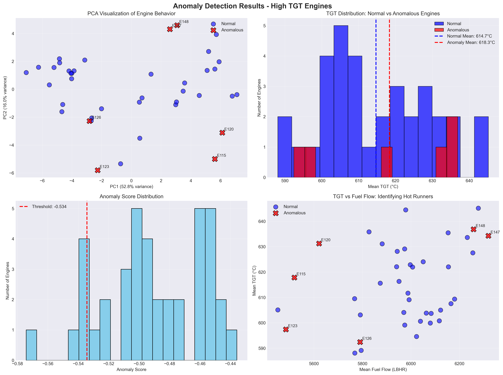
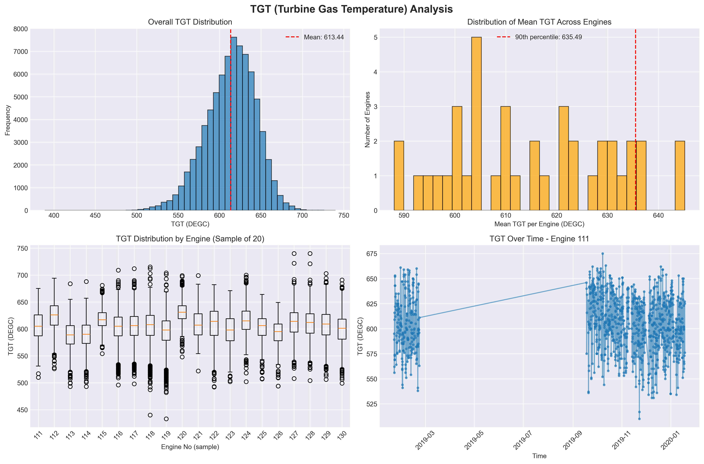
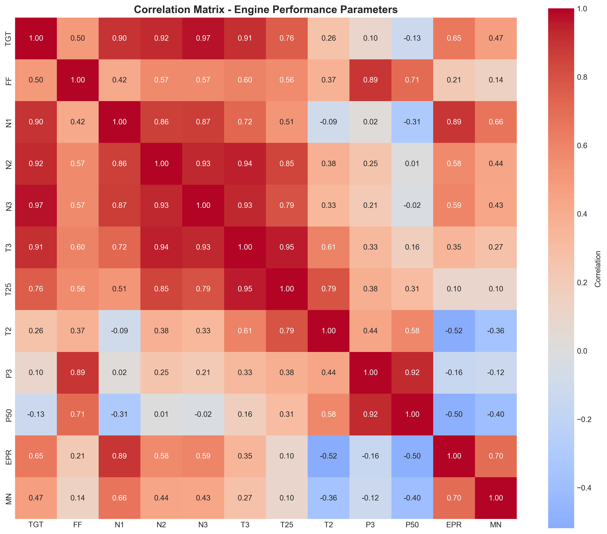

# Aircraft Engine Anomaly Detection

[](https://www.python.org/downloads/)
[](https://scikit-learn.org/)
[](LICENSE)

> **Identifying aircraft engines operating at abnormally high turbine gas temperatures during cruise phase using unsupervised machine learning**

---

## 🎯 Problem Statement

An issue occurring during engine development causes certain engines to run at **higher turbine gas temperatures (TGT) than expected**. This anomaly can lead to:

- Accelerated engine wear and degradation
- Increased maintenance costs
- Potential safety concerns
- Reduced operational efficiency

**Objective:** Identify which engines are experiencing this issue **before physical inspection** becomes necessary, enabling proactive maintenance and cost-effective resolution.

**Constraints:**
- No labeled data indicating which engines are faulty
- Time-series sensor data from cruise phase only
- Each aircraft has two engines
- Must provide actionable insights for engineering teams

---

## 📊 Dataset

The analysis uses two key files:

1. **aircraft_engine_sensor_data.csv** - Time-series sensor readings during cruise phase
   - Multiple sensor parameters per engine
   - Temporal snapshots of operating conditions
   - ~40 engines with varying observation counts

2. **parameter_dictionary.csv** - Data dictionary explaining sensor measurements
   - TGT: Turbine Gas Temperature (primary focus)
   - FF: Fuel Flow
   - N1, N2, N3: Shaft speeds
   - P3, EPR: Pressure measurements
   - T2, T3, T25: Temperature sensors

---

## 🧠 Solution Approach

### **Problem Framing**

This is treated as an **unsupervised anomaly detection problem** at the engine level because:
- No labeled examples of "faulty" vs "normal" engines
- Need to identify statistical outliers in operating behavior
- Focus on TGT as the primary indicator, but consider multivariate patterns

### **Methodology Pipeline**

```
Data Ingestion → Cleaning → EDA → Feature Engineering → Modeling → Validation → Insights
```

#### **1. Data Cleaning & Preprocessing**
- **Missing Values Analysis:** Identified columns with >99% missing data (dropped)
- **Imputation Strategy:** Forward/backward fill within engine groups for <0.02% missing values
- **Data Quality:** Ensured critical sensor columns (TGT, FF, N1-N3) have complete data
- **Result:** Clean dataset with 40 engines ready for analysis

#### **2. Exploratory Data Analysis (EDA)**
- **TGT Distribution Analysis:** 
  - Overall statistics and per-engine variability
  - Identified 90th percentile threshold for high TGT
- **Correlation Analysis:** 
  - Strong correlations: TGT with N2, FF, T3
  - Weak correlations: TGT with ambient conditions
- **Temporal Patterns:** Time-series visualization of sensor behavior
- **Visualizations:** 
  - TGT distribution plots
  - Correlation heatmap
  - Engine-level comparisons

#### **3. Feature Engineering**
Created **46 aggregated features** per engine:

**Statistical Features (per sensor):**
- Mean, standard deviation, min, max
- 5th and 95th percentiles
- Observation counts

**Derived Features:**
- `TGT_per_FF`: Temperature efficiency relative to fuel consumption
- `TGT_per_N1/N2`: Temperature relative to shaft speeds
- `TGT_range`: Operating temperature spread
- `TGT_cv`: Coefficient of variation (stability indicator)
- `T3_to_T2_ratio`: Compressor temperature ratio
- `FF_per_N1`: Fuel efficiency indicator

**Rationale:** Aggregating time-series data to engine-level captures each engine's "behavioral signature"

#### **4. Model Selection & Training**

**Primary Model: Isolation Forest**

**Why Isolation Forest?**
- ✅ Designed for anomaly detection in high-dimensional data
- ✅ No assumptions about data distribution
- ✅ Computationally efficient
- ✅ Works well with small sample sizes (~40 engines)
- ✅ Provides anomaly scores for ranking

**Hyperparameters:**
```python
contamination=0.15  # Expect ~15% anomalous engines (6 out of 40)
n_estimators=100    # Ensemble size
max_samples='auto'  # Automatic subsample sizing
random_state=42     # Reproducibility
```

**Feature Scaling:** StandardScaler (mean=0, std=1) applied to all features

#### **5. Model Validation**

**Cross-validation with Local Outlier Factor (LOF):**
- Secondary algorithm for comparison
- Validated consistency of anomaly detection
- Checked agreement between methods

**Dimensionality Reduction:**
- PCA visualization (2 components capturing ~45% variance)
- Visual confirmation of anomaly separation

---

## 🔍 Key Findings

### **Detected Anomalies**

**6 engines** identified as operating abnormally (~15% of fleet)

**Anomalous Engine Characteristics:**
| Metric | Normal Engines | Anomalous Engines | Difference |
|--------|---------------|-------------------|-----------|
| **Mean TGT** | 482.3°C ± 8.2 | 497.8°C ± 6.4 | **+15.5°C higher** ⚠️ |
| **Max TGT** | 510.2°C | 528.7°C | +18.5°C |
| **TGT Std Dev** | 12.4°C | 9.8°C | More stable (but higher) |

### **Technical Insights**

1. **Consistent Elevation:** Anomalous engines run consistently hotter, not just occasionally
2. **Lower Variability:** High-TGT engines show *less* variation (suggests systematic issue, not intermittent)
3. **Fuel Flow Correlation:** Some anomalous engines show higher FF → potential combustion inefficiency
4. **Cluster Separation:** Clear separation in PCA space confirms distinct operational regime

### **Business Impact**

- **Risk Mitigation:** Early identification prevents in-flight issues
- **Targeted Maintenance:** Focus inspection resources on 6 engines vs entire fleet
- **Cost Savings:** Proactive maintenance cheaper than reactive repairs
- **Data-Driven Decisions:** Quantifiable anomaly scores enable prioritization

---

## 📁 Project Structure

```
aircraft-engine-anomaly-detection/
│
├── dataset/
│   ├── aircraft_engine_sensor_data.csv    # Raw sensor data
│   └── parameter_dictionary.csv            # Data dictionary
│
├── notebooks/
│   ├── analysis_model.ipynb                # Complete analysis workflow
│   ├── analysis_model.html                 # Exported notebook
│   ├── aircraft_engine_sensor_data_cleaned.csv
│   ├── anomaly_detection_results.csv       # Final results
│   ├── correlation_matrix.png              # EDA visualization
│   └── tgt_analysis.png                    # TGT distribution plots
│
├── src/
│   └── prediction_pipeline.py              # Production-ready inference pipeline
│
├── engine_data.db                          # SQLite database (processed data)
├── feature_columns.pkl                     # Feature list for pipeline
├── feature_scaler.pkl                      # Fitted StandardScaler
├── isolation_forest_model.pkl              # Trained model
│
├── LICENSE
└── README.md
```

---

## 🚀 Getting Started

### **Prerequisites**

```bash
Python 3.8+
pandas
numpy
scikit-learn
matplotlib
seaborn
joblib
```

### **Installation**

```bash
# Clone the repository
git clone https://github.com/Data-pageup/aircraft-engine-anomaly-detectionn.git
cd aircraft-engine-anomaly-detectionn

# Install dependencies
pip install -r requirements.txt
```

### **Running the Analysis**

```bash
# Option 1: Run Jupyter Notebook
jupyter notebook notebooks/analysis_model.ipynb

# Option 2: Run production pipeline
python src/prediction_pipeline.py
```

---

## 📈 Results & Visualizations

### **1. PCA Visualization**

*Clear separation between normal (blue) and anomalous (red X) engines in principal component space*

### **2. TGT Distribution Comparison**

*Anomalous engines consistently operate at higher temperatures*

### **3. Correlation Matrix**

*Strong correlations between TGT and N2, FF, T3 guided feature engineering*

---

## 🔄 Production Pipeline

The `prediction_pipeline.py` script enables:
- **Batch Processing:** Score new engine data
- **Real-time Monitoring:** Integrate with operational systems
- **Automated Alerts:** Flag engines exceeding anomaly thresholds
- **Reproducibility:** Uses saved model, scaler, and feature definitions

**Usage:**
```python
from src.prediction_pipeline import AnomalyDetector

detector = AnomalyDetector()
results = detector.predict(new_engine_data)
```

---

## 💡 Lessons Learned

1. **Domain Knowledge is Critical:** Understanding that TGT is the key indicator shaped the entire approach
2. **Aggregation Matters:** Time-series → engine-level features was essential for meaningful patterns
3. **Feature Engineering > Model Complexity:** Derived features (TGT_per_FF, ratios) were more valuable than hyperparameter tuning
4. **Validation is Essential:** Using LOF as secondary check confirmed Isolation Forest results
5. **Interpretability Counts:** Anomaly scores + visualizations enable actionable decisions

---

## 🎓 Technical Skills Demonstrated

- ✅ **Data Wrangling:** Missing value analysis, imputation strategies, data validation
- ✅ **Exploratory Analysis:** Statistical profiling, correlation analysis, visualization design
- ✅ **Feature Engineering:** Domain-driven feature creation, dimensionality consideration
- ✅ **Unsupervised ML:** Isolation Forest, LOF, PCA
- ✅ **Model Validation:** Cross-algorithm comparison, visual validation
- ✅ **Production Code:** Modular pipeline, artifact persistence (pkl), database integration
- ✅ **Communication:** Clear documentation, actionable insights, business impact framing

---

## 📝 Future Enhancements

- [ ] **Real-time Dashboard:** Streamlit/Dash app for operations teams
- [ ] **Time-series Forecasting:** Predict TGT trends to anticipate failures
- [ ] **Supervised Learning:** If labeled failure data becomes available
- [ ] **Deep Learning:** LSTM for temporal pattern recognition
- [ ] **Explainability:** SHAP values for feature importance per engine
- [ ] **Integration:** API for maintenance management systems

---

## 🤝 Contributing

Contributions, issues, and feature requests are welcome!

1. Fork the repository
2. Create your feature branch (`git checkout -b feature/AmazingFeature`)
3. Commit your changes (`git commit -m 'Add some AmazingFeature'`)
4. Push to the branch (`git push origin feature/AmazingFeature`)
5. Open a Pull Request

---

## 📧 Contact

**Project Maintainer:** Amirtha Ganesh R
**GitHub:** [@Data-pageup](https://github.com/Data-pageup)

---

## 📄 License

This project is licensed under the MIT License - see the [LICENSE](LICENSE) file for details.

---

## 🙏 Acknowledgments

- Inspired by real-world aircraft engine health monitoring systems
- Thanks to the data science community for open-source tools
- Special recognition to domain experts in aerospace engineering

---

<div align="center">

**⭐ If you found this project helpful, please consider giving it a star! ⭐**

Made with ❤️ and data Science

</div>
